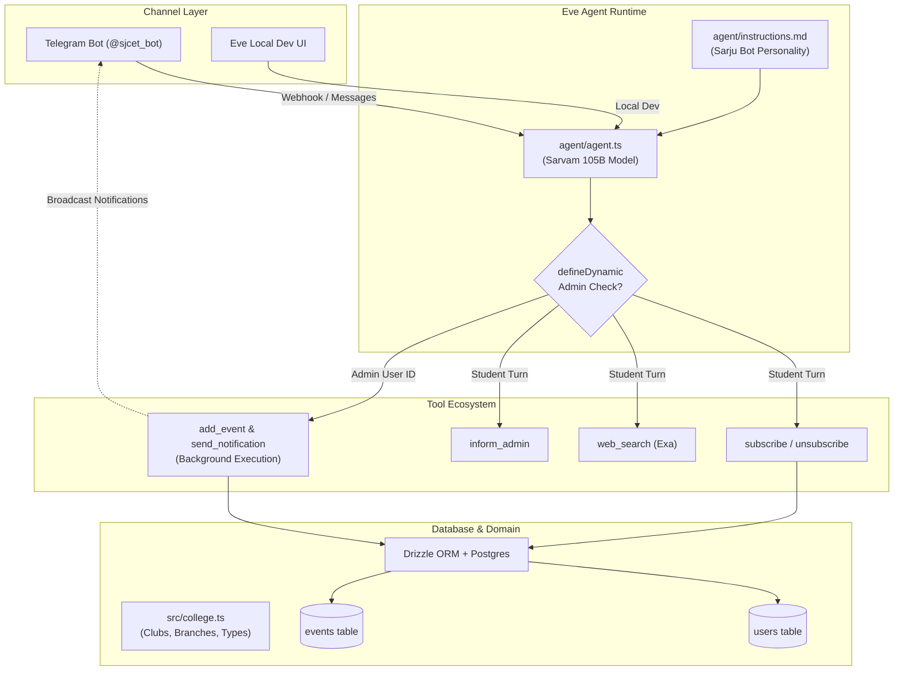

# Sarju Bot - College Events Agentic Bot

**Sarju Bot** ([`@sjcet_bot`](https://t.me/sjcet_bot)) is a campus events assistant built for **St. Joseph's College of Engineering and Technology, Palai (SJCET)** using TypeScript and the **[Eve](https://eve.dev)** agent framework.

The bot is modeled with the persona of Prof. Sarju S—an inspiring entrepreneurship mentor and tech enthusiast at SJCET—combining technical guidance with witty Manglish and Malayalam humor to inform students about campus events and handle subscriptions.

## 1. Architecture Overview



## 2. Tech Stack

| Component | Technology | Description |
| :--- | :--- | :--- |
| **Agent Framework** | [Eve](https://eve.dev) (`eve` `^0.52.3`) | Declarative agent definition, multi-channel handling, dynamic tools, and lifecycle hooks. |
| **LLM Provider** | [Sarvam AI](https://dashboard.sarvam.ai) (`sarvam-105b`) | Optimized for Indic languages (Malayalam, English, Manglish), configured with low reasoning effort. |
| **Database & ORM** | PostgreSQL & [Drizzle ORM](https://orm.drizzle.team) | Manages `users` subscriptions (GIN indexed array) and `events` catalogue. |
| **Messaging Channel** | Telegram Bot API (`eve/channels/telegram`) | Handles private chat events, slash commands, typing indicators, inline keyboards, and broadcasts. |
| **Search Engine** | [Exa AI](https://exa.ai) (`@exalabs/ai-sdk`) | Real-time web search for ground-truth campus event details. |
| **Runtime & Tooling** | Bun / Node.js & Biome | High-speed execution, TypeScript checks (`tsc`), and formatting via Biome. |
| **Hosting** | Vercel (`vercel.json`) | Serverless deployment of Eve webhook endpoints. |

## 3. Project Structure

```
college-bot/
├── agent/                     # Eve Agent definition and logic
│   ├── agent.ts               # Core agent config (Sarvam 105B model, token limits)
│   ├── instructions.md        # System prompt and Sarju Bot personality rules
│   ├── channels/
│   │   ├── telegram.ts        # Telegram message router and slash-command interceptor
│   │   └── eve.ts             # Local development web channel
│   ├── hooks/
│   │   └── audit.ts           # Runtime telemetry & session hooks
│   └── tools/
│       ├── admin.ts           # Dynamic admin-only tools (add_event, send_notification)
│       ├── subscribe.ts       # Student subscription management tool
│       ├── unsubscribe.ts     # Unsubscription tool
│       ├── inform_admin.ts    # Direct feedback/bug reporting tool to admin
│       ├── web_search.ts      # Exa AI web search tool
│       ├── print_info.ts      # Session & Telegram auth verification helper
│       └── get_weather.ts     # Sample demo tool
├── src/                       # Domain models, database layer, and utility libraries
│   ├── college.ts             # SJCET categories, event types, clubs, and departments
│   ├── db/
│   │   ├── schema.ts          # Drizzle schema (users with GIN index, events)
│   │   ├── index.ts           # Postgres database client instance
│   │   └── utils.ts           # Timestamps and schema helper functions
│   └── lib/
│       ├── merge.ts           # Subscriptions tag merge logic
│       ├── unmerge.ts         # Subscriptions tag removal logic
│       ├── notify.ts          # Event notification message formatter
│       └── subscriptions.ts   # Interactive keyboards and tag formatters
├── scripts/                   # Operational and admin helper scripts
│   ├── set-webhook.ts         # Sets Telegram webhook to Eve server URL
│   ├── set-commands.ts        # Registers Telegram bot command suggestions
│   └── send-message.ts        # Direct Telegram test messaging utility
├── drizzle/                   # Drizzle SQL migration files
├── drizzle.config.ts          # Drizzle Kit configuration
├── vercel.json                # Vercel deployment configuration
└── package.json               # Dependencies and scripts
```

## 4. Core Subsystems

### A. Agent Engine & Persona (`agent/`)
* **`agent/agent.ts`**: Configures the agent with `sarvam("sarvam-105b", { reasoning_effort: "low" })` and assigns the model context window.
* **`agent/instructions.md`**: Provides the persona guidelines:
  * Inspired by late Prof. Sarju S from SJCET Palai.
  * Natural code-mixing of Malayalam, English, and Manglish.
  * Humorous catchphrases (e.g., *"pani eduthal tharam"*, *"Call me sir"*, *"mone"*, *"mole"*).
  * Strict anti-hallucination constraint: search the web or declare unknown rather than inventing event dates or venues.

### B. Channels (`agent/channels/`)
* **`agent/channels/telegram.ts`**:
  * Filters out non-private chats and other bots.
  * Dispatches typing indicators (`ctx.telegram.startTyping()`).
  * Intercepts slash commands (`/subscriptions`, `/unsubscribe`) to respond directly without incurring LLM inference costs.
  * Forwards natural chat turns to the LLM with `defaultTelegramAuth(message)`.
  * Handles interactive inline keyboard callback queries.
* **`agent/channels/eve.ts`**: Enables local debugging using Eve's dev dashboard (`eveChannel({ auth: [localDev(), none()] })`).

### C. College Domain & Database Layer (`src/`)
* **`src/college.ts`**: Source of truth for SJCET's taxonomy:
  * **Categories**: Technology (`💻`), Arts & Culture (`🎨`), Sports (`⚽`), Academic (`📚`), Social (`🎉`).
  * **Event Types**: Competition, Workshop, Seminar, Hackathon, Fest.
  * **Clubs**: IEDC, IEEE, GDSC, TinkerHub, MuLearn, FOSS, CSI, NSS, NCC.
  * **Departments**: AI, CS, CY, EC, ME, CE, EE, MCA, MBA, and more.
* **`src/db/schema.ts`**:
  * **`users` table**: Stores Telegram user ID, name, email, and a Postgres string array (`subscriptions`) containing tags such as `category:tech`, `club:iedc`, `department:all`. Indexed using a PostgreSQL **GIN** index for fast array matching.
  * **`events` table**: Stores event title, category, type, club, department, flexible `data` (JSONB), and expiration intervals.

### D. Tools & Permissions (`agent/tools/`)
* **Subscription Management (`subscribe.ts` & `unsubscribe.ts`)**:
  * Parses natural language subscription intent into structured dimensions.
  * Merges/unmerges filters with existing preferences in PostgreSQL via `mergeSubscriptions` and `unmergeSubscriptions`.
* **Dynamic Admin Elevation (`admin.ts`)**:
  * Leverages Eve's `defineDynamic` on the `turn.started` lifecycle hook.
  * Authenticates the user ID against `TELEGRAM_ADMIN_ID`.
  * Exposes privileged tools exclusively to the admin:
    * `add_event`: Inserts validated event data into the database.
    * `send_notification`: Runs in the background (`execution: "background"`), queries matching users using `arrayOverlaps`, formats notifications, chunks them into Telegram-safe lengths, and broadcasts them.
* **Search & Administration (`web_search.ts` & `inform_admin.ts`)**:
  * Exa AI search integration prevents hallucinations regarding real-world events.
  * `inform_admin` enables students or the agent to dispatch bug reports directly to the admin's Telegram account.

## 5. Typical Workflows

### Student Conversation & Subscription
1. Student sends a message in Telegram (e.g., *"Keep me posted on IEDC hackathons"*).
2. `telegramChannel` verifies the chat and triggers the typing state.
3. Sarju Bot infers user intent, calls `subscribe.ts` with `{ clubs: "club:iedc", types: "type:hackathon" }`.
4. The database upserts the student's tags and the bot replies in friendly Manglish.

### Admin Event Creation & Broadcast
1. Admin messages the bot: *"Create a workshop on AI with IEDC tomorrow at 10 AM, and notify subscribers"*.
2. `turn.started` hook identifies the admin's Telegram ID and equips `add_event` and `send_notification`.
3. Agent executes `add_event` to persist the record into the `events` table.
4. Agent executes `send_notification` in the background, querying matching subscribers with `arrayOverlaps` and pushing messages via Telegram Bot API without blocking the chat.
